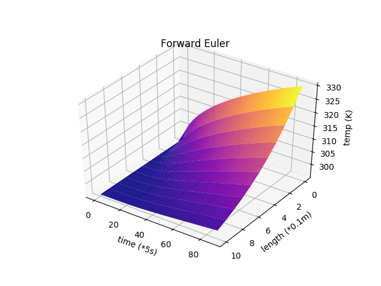
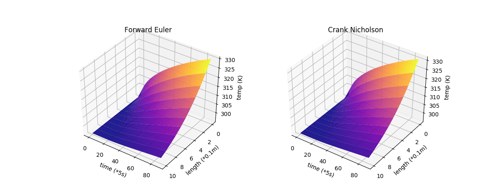

# TransientConduction
 Simple script to calculate and display Transient Thermal Conduction. Originally for an in-depth analysis of an insualtion wall of a solder reflow oven for a thermodynamic project

## Dependencies
 - python2.7 +
 - matplotlib
 - numpy
 
 ## Results
 

## Sources
 - [Wikipedia: Transient Conduction](https://en.wikipedia.org/wiki/Thermal_conduction)
 - [Wikipedia: Crank-Nicolson](https://en.wikipedia.org/wiki/Crank%E2%80%93Nicolson_method)
 - [Inspiration](https://hackaday.io/project/21642-repkiln/log/65537-numerically-solving-the-1d-transient-heat-equation)
 - [In depth comparison from Tennesee Technological University](https://www.cae.tntech.edu/~shan/numerical%20heat%20transfer%20note(ME4730_5730)/transient%201-D%20conduction(2013).pdf)
 - [Another Comparison by Hans Petter Langtangen](http://hplgit.github.io/num-methods-for-PDEs/doc/pub/diffu/sphinx/._main_diffu001.html)
 - [Hindered Settling python implimentation](https://hinderedsettling.com/2015/02/06/exploring-the-diffusion-equation-with-python/)
 - [Another Python implimentation Claudio Bellei](http://www.claudiobellei.com/2016/11/10/crank-nicolson/)
 - [Video Explanation by Sam R](https://www.youtube.com/watch?v=LihC0DzIibo&t=399s)
 
 
